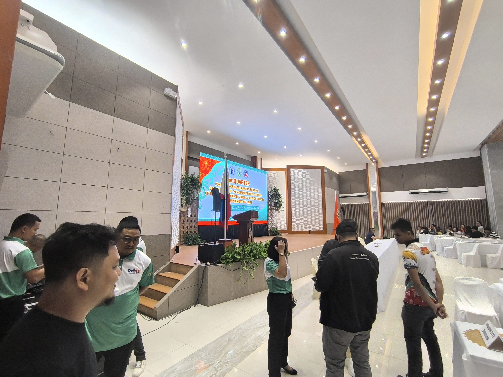
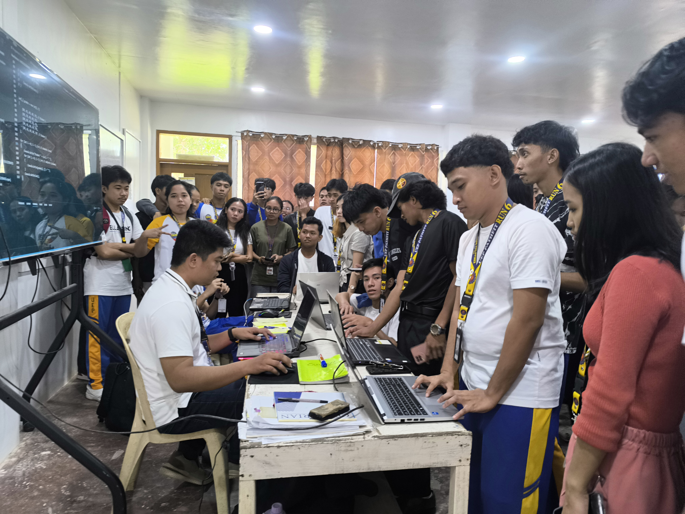
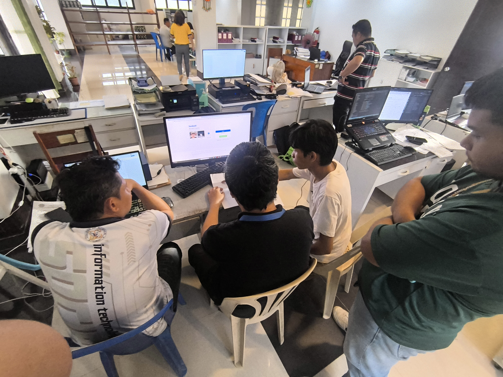

# VCN / Vince Carlo C. Noora

<p align="center">
  
</p>

Personal portfolio website for Vince Carlo C. Noora, an IT professional, systems developer, and UI/UX specialist.

The site presents selected projects, professional experience, technical skills, and contact links in a responsive portfolio interface.

## Visual Showcase

<p align="center">
  
  
  
</p>

### Project Previews

GitHub does not consistently play repository MP4 files inline in README pages. These links open the original video previews from the portfolio assets:

- [Watch ICT-APP preview](assets/ICTAPPvideo/ICTAPP.mp4)
- [Watch FTTS preview](assets/FTTSvideo/FTTS.mp4)
- [Watch SolarSource gameplay preview](assets/SOLARSOURCE/DAY%203%20MOVEMENT%20AND%20COMBAT%20%28PROJECT%20SUNRISE%29.mp4)

## Features

- Responsive portfolio layout for desktop and mobile
- Project showcase with video previews and a video lightbox
- Experience timeline with image galleries
- Mobile navigation menu
- Downloadable resume
- Netlify visitor counter backed by Netlify Blobs
- Smooth scrolling and scroll-based reveal animations

## Built With

- HTML5
- CSS3
- Vanilla JavaScript
- Netlify Functions
- Netlify Blobs
- Google Fonts: DM Sans, DM Mono, and Playfair Display

## Portfolio Projects

- [ICT-APP](https://github.com/SirVinceNoora/ICT-APP) - Kotlin application project from the BYTEFORGE workspace
- Class DSA Demo - C# demonstrations for data structures and algorithms
- [FTTP / FTTS](https://github.com/SirVinceNoora/FTTP) - Project currently halted
- [SolarSource](https://github.com/SirVinceNoora/SOLARSOURCE) - Game currently in development

## Experience Covered

- IT Support Specialist at DepEd Philippines
- Part-time Lecturer at the University of Eastern Philippines
- GUI Designer and Frontend Developer for the UEP eAdmission Portal
- IT Technician at the University of Eastern Philippines

## Run Locally

This is primarily a static website, so the frontend can be previewed with any local HTTP server.

### Option 1: VS Code Live Server

1. Open the project folder in VS Code.
2. Start the site with the Live Server extension.
3. Open the local URL provided by the extension.

### Option 2: Python

```bash
python -m http.server 8000
```

Then open <http://localhost:8000>.

### Install the Netlify Function dependency

The visitor counter uses `@netlify/blobs`:

```bash
npm install
```

To test the site together with the Netlify Function locally, install the Netlify CLI and run:

```bash
netlify dev
```

The function is available at `/.netlify/functions/visitor-count`.

## Deployment

The project is configured for Netlify. The functions directory is declared in `netlify.toml`:

```toml
[functions]
  directory = "netlify/functions"
```

To deploy:

1. Import the repository into Netlify.
2. Use the repository root as the publish directory.
3. Run `npm install` during the build environment setup.
4. Deploy the site.

The visitor counter requires a Netlify deployment with Netlify Blobs enabled and appropriate site access.

## Project Structure

```text
.
├── assets/                 # Portfolio media, resume, images, and videos
├── css/                    # Site stylesheets
├── js/                     # Frontend interactions
├── netlify/functions/      # Netlify serverless functions
├── index.html              # Main portfolio page
├── netlify.toml            # Netlify configuration
├── package.json            # Node dependency metadata
└── LICENSE                 # Apache License 2.0
```

## Contact

- Email: [vincecarlonoora@gmail.com](mailto:vincecarlonoora@gmail.com)
- GitHub: [SirVinceNoora](https://github.com/SirVinceNoora)
- LinkedIn: [Vince Carlo Noora](https://www.linkedin.com/in/vince-carlo-noora-30a831356/)
- YouTube: [@v1n-c3](https://www.youtube.com/@v1n-c3)

## License

This project is licensed under the [Apache License 2.0](LICENSE).
